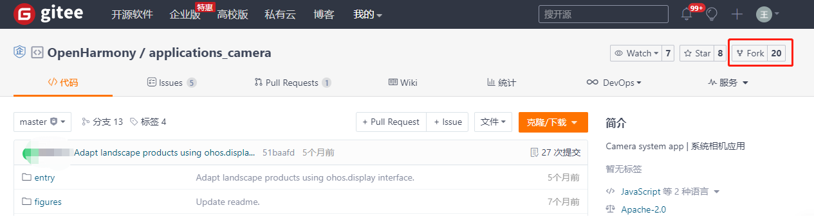
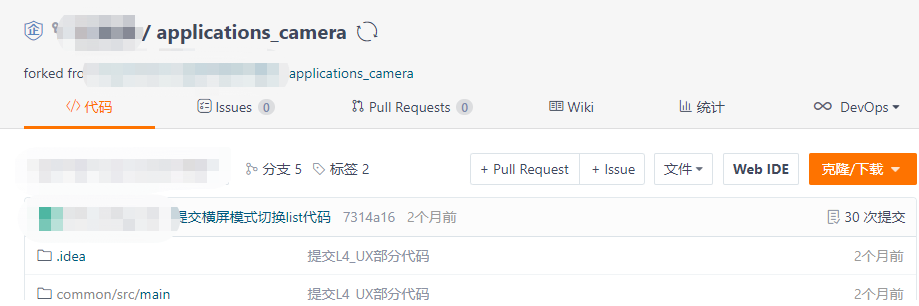
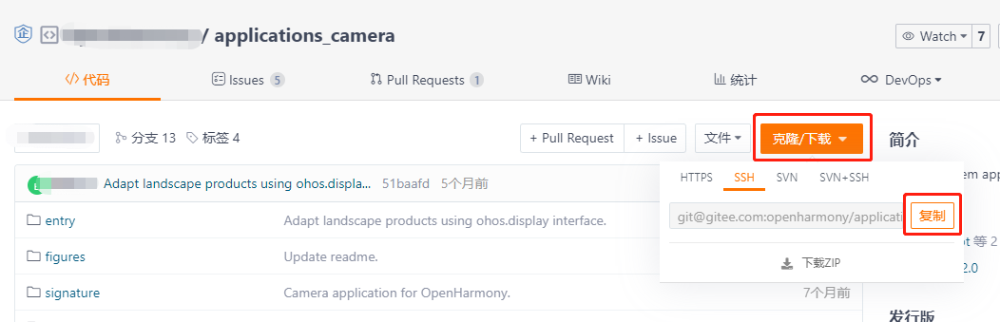
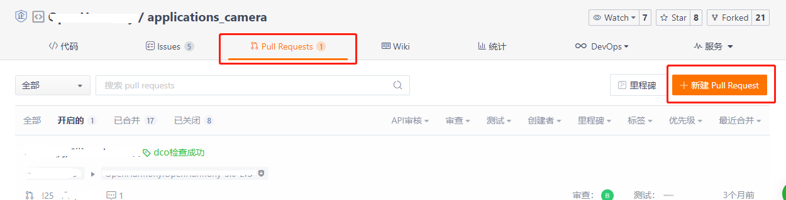

# Camera 源码开发说明
## 1. 项目介绍
相机应用是OpenHarmony标准系统中预置的系统应用，为用户提供基础的相机拍摄功能，包括预览、拍照、摄像、缩略图显示、跳转相册、多机位协同。 
Camera 采用纯 arkui-ts 语言开发，开发过程中不涉及任何 Java 部分的代码。
## 2. 工程结构
### 目录结构
```
/applications
├── common        # 公共模块目录
│   └── src
│       └── main
│           ├── ets  # ets代码目录
│               ├── default
│                   ├── Camera         # Camera组件管理目录
│                   ├── model          # Model层代码目录
│                   ├── redux          # 应用的状态容器
│                   ├── utils          # 工具类代码目录
│           ├── resources    # 资源目录
│           ├── config.json  # 项目配置信息
├── feature                  # feature层模块目录
│   └── featurecommon        # 主Camera模块目录
│       └── src
│           └── main
│               ├── ets  # ets代码目录
│                   ├── com
│                       ├── ohos      # ets代码目录
│                           ├── featurecommon       # ets代码目录
│                               ├── animate         # 动画目录
│                               ├── cameraswitcher  # 前后置切换目录
│                               ├── customDialog    # 弹窗目录
│                               ├── featureservice  # feature服务
│                               ├── shutterbutton   # 拍照目录
│                               ├── thumbnail       # 缩略图目录
│                               ├── Mode.ets        # 模式切换mode
│              ├── resources  # 资源目录
│              ├── config.json  # 项目配置信息
│   └── photo        # 拍照模块目录
│       └── src
│           └── main
│               ├── ets  # ets代码目录
│                   ├── com
│                       ├── ohos
│                           ├── photo      # 拍照ets代码目录
│               ├── resources              # 资源目录
│               ├── config.json            # 项目配置信息
│   └── video        # 摄像模块目录
│       └── src
│           └── main
│               ├── ets  # ets代码目录
│                   ├── com
│                       ├── ohos
│                           ├── video      # 摄像ets代码目录
│               ├── resources              # 资源目录
│               ├── config.json            # 项目配置信息
├── product                                # 产品层模块目录
│   └── phone                              # phone模式模块目录
│       └── src
│           └── main
│               ├── ets  # ets代码目录
│                   ├── MainAbility
│                       ├── common         # ets代码目录
│                       ├── pages          # 业务特性的View层目录
│                       ├── res            # 业务特性涉及的图片目录
│                       ├── workers        # worker多线程处理
│               ├── resources  # 资源目录
│               ├── config.json  # 项目配置信息
│   └── tablet                             # tablet模式模块目录
│       └── src
│           └── main
│               ├── ets  # ets代码目录
│                   ├── MainAbility
│                       ├── common         # ets代码目录
│                       ├── pages          # 业务特性的View层目录
│                       ├── res            # 业务特性涉及的图片目录
│                       ├── workers        # worker多线程处理
│               ├── resources  # 资源目录
│               ├── config.json  # 项目配置信息
```
### 整体架构


Camera的Common层以Redux框架和Camera Worker为基础，向上扩展出Feature和Product层。
应用整体采用了多模块的设计方式，每个模块都遵循上述架构原则。

各层的作用分别如下：
- Product层：区分不同产品，不同屏幕的各形态，含有应用窗口、个性化业务，组件的配置以及个性化资源包。
- Feature层：抽象的公共特性组件集合，每个特性解耦独立可打包为har，可以被每个业务态所引用。
- Common层：负责数据服务、UI组件、工具组、数据持久层、动效层、外部交互层等部件内公共能力，每个应用形态都必须要依赖的模块。


应用各层中重要类及其功能如下表所示
|模块|层级|模块名|作用|
|-|-|-|-|
|camera|Product层|Phone|手机模块。|
|camera|Product层|Tablet|平板模块。|
|camera|Product层|Watch|智能穿戴模块。|
|camera|Product层|PC|电脑模块。|
|camera|Feature层|Photo mode|拍照模式。|
|camera|Feature层|Video mode|录像模式。|
|camera|Feature层|分布式 mode|分布式模式。|
|camera|Common层|Common Function|公共能力模块。|
|camera|Common层|Common UI Components|公共UI组件。|
|camera|Common层|Redux frame|Redux框架。|
|camera|Common层|Utils|工具类合集。|
|camera|Common层|AsyncManager|异步通信管理。|
|camera|Common层|Camera worker|相机后台线程。|

## 3 典型接口的使用
1. 获取Camera能力
```ets
  import camera from '@ohos.multimedia.camera'
  getCameras() {
    cameras = camera.getCameraManager(null).getCameras()
    if (cameras) {
        console.info(`getCameras success.`)
        for (let i = 0; i < cameras.length; i++) {
          console.info(`--------------Camera Info-------------`)
          console.info(`camera_id: ${cameras[i].cameraId}`)
          console.info(`cameraPosition: ${cameras[i].cameraPosition}`)
          console.info(`cameraType: ${cameras[i].cameraType}`)
          console.info(`connectionType: ${cameras[i].cameraType}`)
        }
      } else {
          console.info(`getCameras failed.`)
      }
  }
```

2. 启动相机
```ets
  startPreview() {
    cameraInput = await cameraManager.createCameraInput(cameraId)
    captureSession = await camera.createCaptureSession(null)
    if (captureSession) {
      console.info(`createCaptureSession success.`)
      this.previewOutput = await camera.createPreviewOutput(this.previewId)
      await this.captureSession.beginConfig()
      await this.captureSession.addInput(this.cameraInput)
      await this.captureSession.addOutput(this.previewOutput)
      console.info(`startPreview success.`)
    } else {
      console.info(`createCaptureSession failed.`)
    }
```

3. 拍照
```ets
  import image from '@ohos.multimedia.image'
  takePicture() {
     let mReceiver = image.createImageReceiver(imageWidth, imageHeight, 4, 8)
     let mSurfaceId = await mReceiver.getReceivingSurfaceId()
     await camera.createPhotoOutput(mSurfaceId).then((picture) => {
            console.info(`createPhotoOutput called: ${picture}`)
     })
  }
```

4. 切换镜头
```ets
  import camera from '@ohos.multimedia.camera'
  switchCamera(cameraId) {
    await captureSession.stop()
    await cameraInput.release()
    await captureSession.release()
    cameraInput = await cameraManager.createCameraInput(cameraId)
    captureSession = await camera.createCaptureSession(null)
    if (captureSession) {
      console.info(`createCaptureSession success.`)
      this.previewOutput = await camera.createPreviewOutput(this.previewId)
      await this.captureSession.beginConfig()
      await this.captureSession.addInput(this.cameraInput)
      await this.captureSession.addOutput(this.previewOutput)
      console.info(`startPreview success.`)
    } else {
      console.info(`createCaptureSession failed.`)
    }
```

## 4. 签名打包
### 签名
#### 签名文件的获取
1. 拷贝 OpenHarmony 标准版的 prebuilts\signcenter 目录到操作目录。
2. 拷贝 Camera 工程的 signature\Camera.p7b 到该目录下。

备注：如果需要生成并使用自己的签名文件可参考https://gitee.com/openharmony/docs/blob/master/zh-cn/application-dev/quick-start/configuring-openharmony-app-signature.md

#### 签名文件的配置
打开项目工程，选择 File → Project Structure


选择 Modules → Signing Configs，将对应的签名文件配置如下，完成后点击Apply，再点击OK。
密码为生成签名文件时的密码，如果使用默认的签名文件，则使用默认密码123456。


配置完成后，对应的build.gradle文件中会出现如下内容


### 打包
DevEco Studio 支持 debug 与 release 两种打包类型。可以在 OhosBuild Variants 窗口中进行切换。

 

#### release打包
1. 代码准备完成后，在 OhosBuild Variants 窗口的 Selected Variant 中选择 release   
   
    

2. 选择Build → Build Haps(s)/APP(s) → Build Hap(s)

   

3. 编译完成后，hap包会生成在工程目录下的 `\build\outputs\hap\release\`路径下（如果没有配置签名，则只会生成未签名的hap包）
   
   


## 5. 安装、运行、调试
### 应用安装
配置 hdc：
进入SDK目录中的toolchains文件夹下，获取文件路径：


并将此路径配置到环境变量中：


连接开发板，打开一个新的cmd命令窗口，执行`hdc list targets`，弹出窗口如下：


等待一段时间后，窗口出现如下打印，可回到输入 hdc list targets 的命令窗口继续操作:


再次输入hdc list targets，出现如下结果，说明hdc连接成功


获取 root 权限与读写权限：

```
hdc target mount
```

***T.B.D smode 不执行的情况下，hdc target mount 能否正常执行？***

将签名好的 hap 包放入设备的 `/system/app` 目录下，并修改hap包的权限。发送文件命令如下：

```
hdc file send 本地路径 /system/app/hap包名称
```
例：将当前本地目录的 `Camera.hap` 文件放入到 `system/app/Camera.hap` 文件中。
```
hdc file send Camera.hap /system/app/Camera.hap
```
> 注意，如果设备不存在 `/system/app` 目录，则需要手动创建该目录并修改权限。
> ```
> hdc shell
> cd system
> mkdir app
> chmod 777 app
> ```
> `/system/app` 目录放置系统应用，例如：Camera，SystemUI，Settings 等。
> 
> 但hap包需要在该目录下手动设置权限
> ```
> chmod 666 hap包名
> ```
> 此目录应用不用手动安装，系统自动拉起。
### 应用运行
Camera 属于系统应用，在将签名的 hap 包放入 `/system/app` 目录后，重启系统，应用会自动拉起。
```
hdc shell
reboot
（不可以直接执行hdc reboot，命令是无效的)
```
***T.B.D 直接执行 `reboot`，还是执行`hdc shell reboot`？***
> 注意，如果设备之前安装过系统应用，则需要执行如下两条命令清除设备中存储的应用信息才能够在设备重启的时候将我们装入设备的新 hap 包正常拉起。
> ```
> hdc shell rm -rf /data/accounts/
> hdc shell rm -rf /data/misc_de/0/mdds/0/default/bundle_manager_service
> ```
### 应用调试
#### log打印
- 在程序中添加 log
```JS
console.info("Camera log info");
```
可以在DevEco Studio中查看log

#### log获取及过滤
- log获取
  
将log输出至文件  
```
hdc shell hilog > 输出文件名称
```

例：
在真实环境查看log，将全log输出到当前目录的hilog.log文件中
```
hdc shell hilog > hilog.log
```

- log过滤

在命令行窗口中过滤log
```
hilog | grep 过滤信息
```

例：过滤包含信息 Label 的 hilog
```
hilog | grep Label
```
## 6. 贡献代码
### Fork 代码仓库
1. 在码云上打开 Camera 代码仓库（[仓库地址](https://gitee.com/openharmony/applications_camera)）。
2. 点击仓库右上角的 Forked 按钮
   
3. 在弹出的画面中，选择将仓库 fork 到哪里，点击确认。
   
4. Fork 成功之后，会在自己的账号下看见 fork 的代码仓库。
   

### 提交代码
1. 访问我们自己在码云账号上 fork 的代码仓库，点击“克隆/下载”按钮，选择 SSH，点击“复制”按钮。
   

2. 在本地新建 Camera 目录，在 Camera 目录中执行如下命令
   ```
   git clone 步骤1中复制的地址
   ```

3. 修改代码。
   > 将代码引入工程，以及编译工程等相关内容请参见 **3. 代码使用** 部分的相关内容。
4. 提交代码到 fork 仓库。  
   > 修改后的代码，首先执行 `git add` 命令，然后执行 `git commit` 命令与 `git push` 命令，将代码 push 到我们自己的 fork 仓中。
   > 关于代码提交的这部分内容涉及 git 的使用，可以参照 [git官网](https://git-scm.com/) 的内容，在此不再赘述。

### 发起 Pull Request (PR)
在将代码提交到 fork 仓之后，我们可以通过发起 Pull Request（PR）的方式来为 OpenHarmony 的相关项目贡献代码。

1. 打开 fork 仓库。选择 `Pull Requests` → `新建 Pull Request`
   
   

2. 在 `新建 Pull Request` 画面填入标题与说明，点击 `创建` 按钮。
   
   
3. 创建 Pull Request 完成。 PR 创建完成后，会有专门的代码审查人员对代码进行评审，评审通过之后会合入相应的代码库。
   
   


